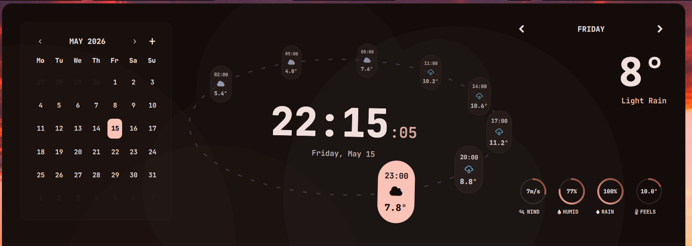
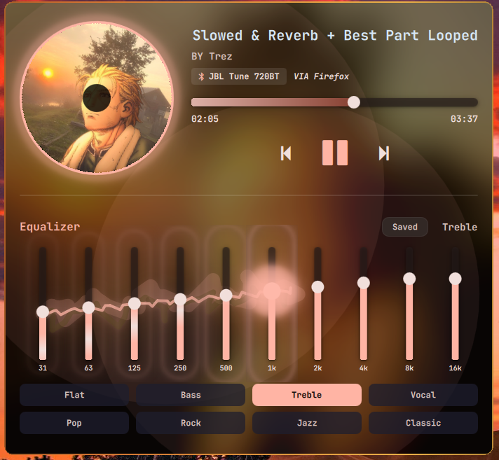
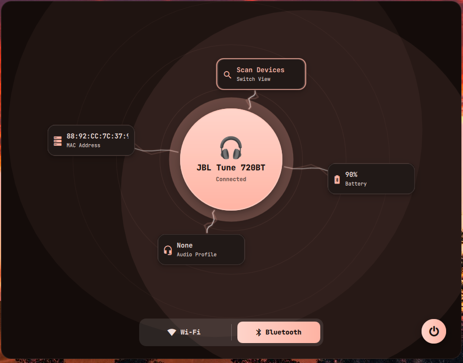
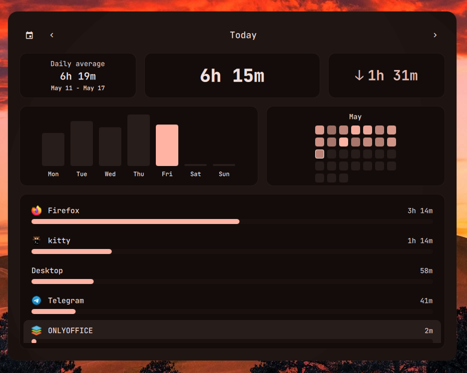
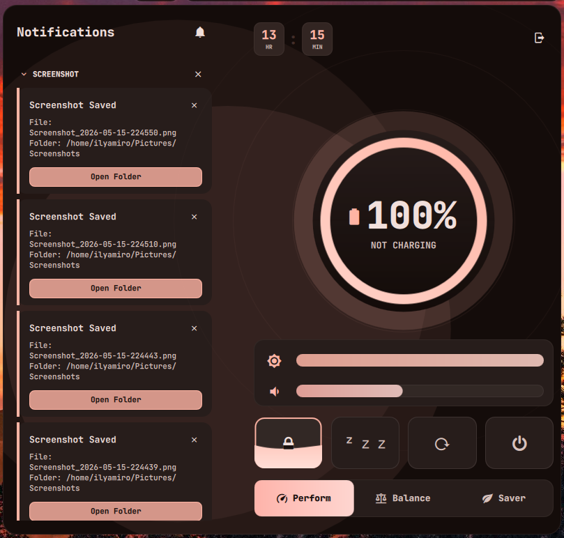
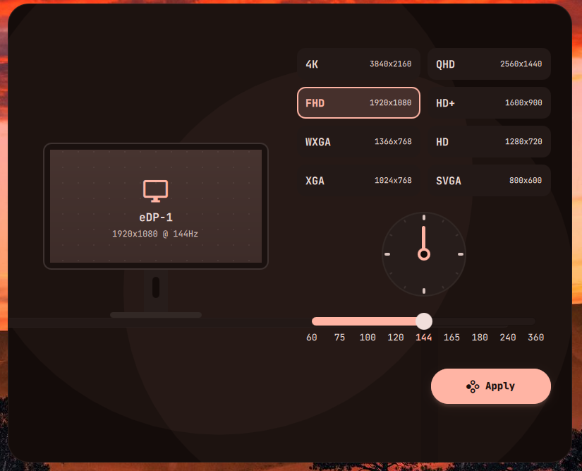
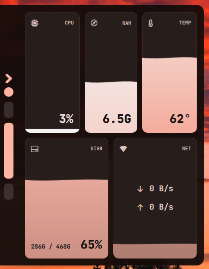
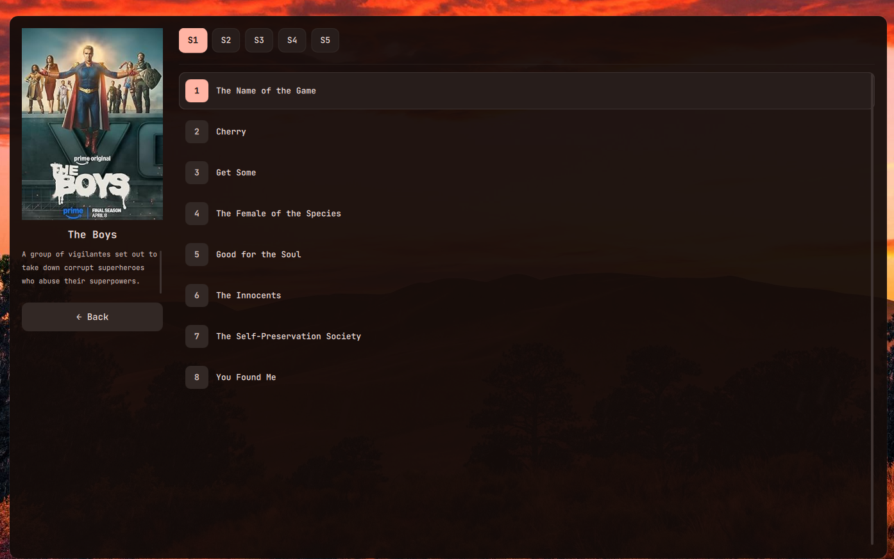

[](https://ko-fi.com/ilyamiro)

# Big announcement to all of my users! 
### The v2.0 Update is turning my dotfiles into a new shell - expect Serpantinum to come out before the end of August!


## Do NOT install it on NixOS. This config has a lot adapting to do, until I introduce flakes.
## Arch installer now available for everyone. Just run this: 

```bash
bash -c "$(curl -fsSL https://raw.githubusercontent.com/ilyamiro/imperative-dots/master/install.sh)"
```

> [!WARNING]
> DO NOT LAUNCH THIS AS ROOT!

> [!NOTE]
> This installer sends anonymous non-identifying telemetry that helps me debug problems and track the amount of users

### You can find all of my wallpapers **[HERE](https://github.com/ilyamiro/shell-wallpapers)**.

## Previews of my desktop

---












